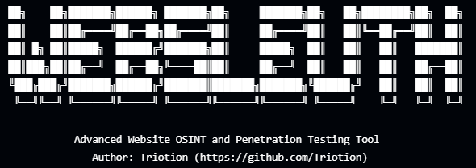

# WebSleuth - Advanced Website OSINT and Penetration Testing Tool

<p align="center">
  
</p>

<p align="center">
  <a href="#features">Features</a> •
  <a href="#installation">Installation</a> •
  <a href="#usage">Usage</a> •
  <a href="#modules">Modules</a> •
  <a href="#legal-disclaimer">Legal Disclaimer</a> •
  <a href="#contributions">Contributions</a> •
  <a href="#donations">Donations</a>
</p>

WebSleuth is a comprehensive website reconnaissance and vulnerability assessment tool designed for security professionals, penetration testers, and bug bounty hunters. It combines multiple OSINT and security testing techniques into a unified, easy-to-use command-line tool.

## Features

- **Information Gathering**: Collect domain information, DNS records, IP addresses, WHOIS data
- **Subdomain Enumeration**: Discover subdomains using brute force, certificate transparency logs, and other sources
- **Web Technologies Analysis**: Identify frontend/backend technologies, frameworks, CMS, and libraries
- **Content Discovery**: Find hidden files, directories, and endpoints, including backup files and sensitive information
- **Security Headers Analysis**: Evaluate security header implementation and assign a security grade
- **SSL/TLS Assessment**: Check certificates, protocols, ciphers, and vulnerabilities (BEAST, POODLE, etc.)
- **Port Scanning**: Discover open ports and services with accurate detection
- **WAF Detection**: Identify and fingerprint Web Application Firewalls with precision
- **Vulnerability Scanning**: Check for XSS, SQL injection, LFI, and other web vulnerabilities
- **Screenshot Capture**: Visualize target websites and subdomains using automated browsers
- **DNS Security Analysis**: Check DNS configuration for vulnerabilities and misconfigurations
- **Reporting**: Generate comprehensive reports in multiple formats (HTML, JSON, PDF) with interactive dashboards

## Installation

### From PyPI (Recommended)

```bash
pip install websleuth
```

### From Source

```bash
# Clone the repository
git clone https://github.com/Triotion/websleuth.git
cd websleuth

# Install the package
pip install -e .
```

### Requirements

- Python 3.8 or higher
- Dependent Python libraries (automatically installed):
  - requests, BeautifulSoup4, dns-python, python-whois
  - cryptography, OpenSSL, rich, selenium
  - and more (see requirements.txt)

## Usage

### Basic Usage

```bash
# Scan a website with all modules
websleuth -u https://example.com -a

# Only perform specific scans
websleuth -u https://example.com -i -s -t -sh

# Save report in specific format
websleuth -u https://example.com -a -f json
```

### Command Line Options

```
-u, --url            Target URL (e.g., https://example.com)
-a, --all            Run all scans
-i, --info           Gather basic information
-s, --subdomains     Enumerate subdomains
-t, --technology     Detect web technologies
-c, --content        Discover hidden content
-sh, --security-headers  Check security headers
-ssl, --ssl-check    Check SSL/TLS configuration
-p, --ports          Scan for open ports
-w, --waf            Detect WAF
-v, --vuln           Scan for vulnerabilities
-sc, --screenshot    Capture screenshots
-dns, --dns-security Check DNS security configuration
-o, --output         Output directory (default: output)
-f, --format         Report format: html, json, pdf, all (default: html)
-q, --quiet          Quiet mode
-d, --debug          Debug mode
-T, --threads        Number of threads (default: 50)
-to, --timeout       Connection timeout in seconds (default: 5)
--port-range         Port range to scan (e.g., 1-1000) (default: 1-1024)
-h, --help           Show help message
```

## Modules

### Information Gathering
Collects basic information about the target website, including:
- Domain information and IP addresses
- DNS records (nameservers, MX, TXT)
- WHOIS data including registrar, creation/expiration dates
- HTTP headers analysis
- Robots.txt and Sitemap.xml content

### Subdomain Enumeration
Discovers subdomains using various techniques:
- DNS brute force using customizable wordlists
- Certificate Transparency logs (crt.sh)
- DNS Dumpster and AlienVault OTX integration
- Passive DNS sources

### Technology Scanner
Detects web technologies with comprehensive coverage:
- Content Management Systems (WordPress, Joomla, Drupal, etc.)
- Web frameworks (React, Angular, Vue, Django, Laravel, etc.)
- Programming languages (PHP, Python, Ruby, etc.)
- JavaScript libraries and frameworks
- Analytics tools and tracking services
- Content Delivery Networks (CDNs)
- Server software and versions

### Content Discovery
Finds hidden files, directories, and sensitive information:
- Common files and directories using extensive wordlists
- Backup files and development leftovers
- Configuration files and sensitive information
- API endpoints and documentation
- Custom wordlist support for targeted scanning

### Security Headers Analyzer
Analyzes security headers with detailed scoring:
- Strict-Transport-Security (HSTS)
- Content-Security-Policy (CSP)
- X-Content-Type-Options
- X-Frame-Options
- X-XSS-Protection
- Referrer-Policy
- Permissions-Policy
- Detailed recommendations for improvement

### SSL/TLS Checker
Performs comprehensive SSL/TLS security assessment:
- Certificate validation and expiration checks
- Supported protocols analysis (TLS 1.3, 1.2, 1.1, 1.0, SSL 3.0)
- Cipher suite evaluation
- Common vulnerabilities detection (BEAST, POODLE, Heartbleed, FREAK, etc.)
- Security grading (A+ to F)

### Port Scanner
Efficiently scans for open ports and services:
- Fast TCP connect scanning
- Common port scanning
- Custom port range specification
- Service identification
- Rate limiting to avoid detection

### WAF Detector
Detects and identifies Web Application Firewalls:
- Signature-based detection for major WAFs (Cloudflare, AWS WAF, etc.)
- Behavior-based detection using sophisticated probes
- Evasion techniques testing
- Confidence scoring for accuracy

### Vulnerability Scanner
Scans for common web vulnerabilities:
- Cross-Site Scripting (XSS)
- SQL Injection (SQLi)
- Local File Inclusion (LFI)
- Cross-Site Request Forgery (CSRF)
- Form-based vulnerability testing
- Parameter-based vulnerability testing
- Comprehensive reporting with severity ratings

### Screenshot Capture
Captures high-quality screenshots of websites:
- Main website screenshot
- Subdomain visualization
- Headless browser automation with Selenium
- Customizable resolution and settings
- Screenshot embedding in HTML reports

### DNS Security Analysis
Analyzes DNS configuration for security issues:
- SPF, DKIM, and DMARC record validation
- DNSSEC configuration checking
- Zone transfer attempts
- DNS cache poisoning vulnerability assessment
- Misconfigurations detection

## Legal Disclaimer

This tool is provided for educational and ethical testing purposes only. Always obtain proper authorization before testing any systems that you do not own. Unauthorized scanning and testing is illegal and unethical.

The developers of WebSleuth are not responsible for any misuse, damage, or illegal activities performed using this tool.

## Contributions

Contributions are welcome! Please feel free to submit a Pull Request.

1. Fork the repository
2. Create your feature branch (`git checkout -b feature/amazing-feature`)
3. Commit your changes (`git commit -m 'Add some amazing feature'`)
4. Push to the branch (`git push origin feature/amazing-feature`)
5. Open a Pull Request

## License

This project is licensed under the MIT License - see the [LICENSE](LICENSE) file for details.

## Donations

If you find this tool valuable, consider donating to support ongoing development:

- BTC: bc1qtkm7dzjp76gx8t9c02pshfd8rzarj6gj9yzglu
- ETH: 0x88Aa0E09a5A62919321f38Fb4782A17f4dc91A9B
- XMR: 0x6730c52B3369fD22E3ACc6090a3Ee7d5C617aBE0

## Author

- [Triotion](https://github.com/Triotion) 
